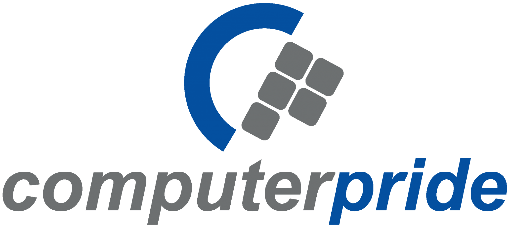

# Computer Pride - Modern IT Training Platform

A modern, responsive website for Computer Pride - Kenya's premier IT training and certification center.



## 🚀 Features

- **Training Programs** - Short courses, professional courses, and vendor-based certifications
- **Student Enrollment** - Course-specific enrollment with dynamic forms
- **Certifications** - Authorized testing center for Pearson VUE, PSI, and Certiport
- **Business Solutions** - ERP, CRM, custom development, and cloud migration services
- **Infrastructure** - E-commerce style IT hardware catalog
- **Mobile App Promotion** - iOS and Android app download CTAs
- **Multi-location** - Offices in Nairobi, Mombasa, and Kampala

## 🛠️ Tech Stack

- **Framework**: React Router v7 (Remix)
- **Styling**: Tailwind CSS v4
- **Language**: TypeScript
- **Runtime**: Node.js 20

## 📦 Installation

```bash
# Install dependencies
npm install

# Start development server
npm run dev

# Build for production
npm run build

# Start production server
npm run start
```

## 🌐 Deployment to Render

This project includes a `render.yaml` Blueprint for easy deployment to Render.com.

### Option 1: Blueprint (Recommended)

1. Push this repo to GitHub
2. Go to [Render Dashboard](https://dashboard.render.com/)
3. Click **New** → **Blueprint**
4. Connect your GitHub repo
5. Render will automatically detect `render.yaml` and deploy

### Option 2: Manual Setup

1. Create a new **Web Service** on Render
2. Connect your GitHub repo
3. Configure:
   - **Build Command**: `npm install && npm run build`
   - **Start Command**: `npm run start`
   - **Environment**: Node
4. Add environment variable: `NODE_ENV=production`

## 📁 Project Structure

```
app/
├── components/        # Shared components (Navbar, Footer)
├── routes/           # Page routes
│   ├── home.tsx      # Homepage
│   ├── training/     # Training section
│   │   ├── index.tsx
│   │   ├── short-courses.tsx
│   │   ├── professional.tsx
│   │   └── vendor-based.tsx
│   ├── certifications.tsx
│   ├── solutions.tsx
│   ├── infrastructure.tsx
│   ├── about.tsx
│   ├── contact.tsx
│   └── enroll.tsx    # Student enrollment
├── app.css           # Global styles & Tailwind config
├── root.tsx          # App shell
└── routes.ts         # Route configuration
public/
├── cpl-logo-1-2048x923.png
├── icon.png          # Favicon
└── favicon.ico
```

## 📞 Contact

**Computer Pride**
- 🌐 Website: [computer-pride.co.ke](https://computer-pride.co.ke)
- 📧 Email: info@computer-pride.co.ke
- 📞 Phone: (+254) 20 2221973

### Locations
- **Nairobi**: 1st Floor, JKUAT Tower, Kenyatta Avenue
- **Mombasa**: 1st Floor, Mombasa Trade Centre, Nkurumah Road
- **Kampala**: 4th Floor, The Acacia Mall, Off Acacia Avenue

## 📄 License

© 2024 Computer Pride. All rights reserved.
